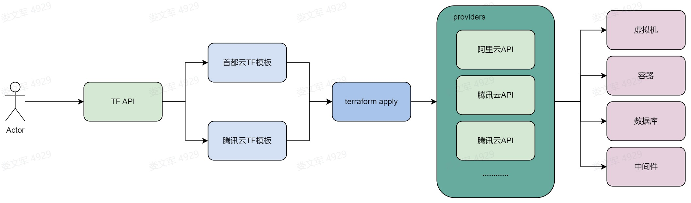
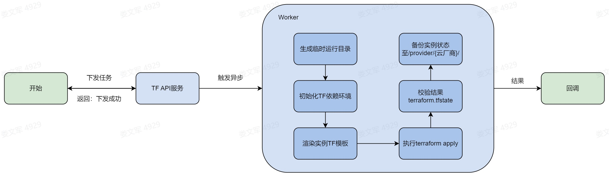

## 一、说明

基于Terraform的特性，进行二次封装，目的是将各个云厂商统一接口参数，提供采购平台、CMDB平台或者其他服务进行调用，该功能支持云主机实例的创建、扩缩容、关机、删除等；
## 二、流程图

**架构图**



**API调用过程**



## 三、API文档

### 1. 创建虚拟机

- **请求方法: POST**
- **URL： http://<host>/terraform/vm**
- **Header参数**

| 参数  | 是否必填 | 类型   | 描述      |
| ----- | -------- | ------ | --------- |
| token | yes      | string | Token认证 |

- **Body参数**

| 参数     | 是否必填 | 类型   | 描述                   |
| -------- | -------- | ------ | ---------------------- |
| job_id   | yes      | string | 任务ID，唯一           |
| csp      | yes      | string | 云厂商：[cds, tencent] |
| callback | yes      | string | 回调接口               |
| data     | yes      | dict   | 实例相关参数           |

- **Data参数说明**

| 参数                       | 是否必填 | 类型   | 描述                                                         |
| -------------------------- | -------- | ------ | ------------------------------------------------------------ |
| region                     | yes      | string | 地区标识：ap-shanghai                                        |
| instance_name              | yes      | string | 实例名                                                       |
| availability_zone          | yes      | string | 可用区                                                       |
| system_disk_size           | yes      | string | 系统磁盘                                                     |
| system_disk_type           | yes      | string | 磁盘类型                                                     |
| security_groups            | yes      | string | 安全组                                                       |
| vpc_id                     | yes      | string | 私有网络ID                                                   |
| subnet_id                  | yes      | string | 私有网络子网ID                                               |
| internet_max_bandwidth_out | yes      | number | 外网带宽限制（M）                                            |
| count                      | yes      | number | 实例数量                                                     |
| tags                       | yes      | list   | 标签：{key:value}                                            |
| image_id                   | yes      | string | 镜像ID                                                       |
| cpu                        | yes      | int    | CPU                                                          |
| memory                     | yes      | int    | 内存                                                         |
| image_passwd               | yes      | string | 镜像密码                                                     |
| public_key                 | yes      | string | 公钥                                                         |
| password                   | yes      | string | 服务器密码                                                   |
| instance_type              |          |        | 实际请参考云厂商文档： 腾讯云实例规格文档 首云实例规格列表   |
| instance_charge_type       | yes      | string | 实例计费模式。取值范围： PREPAID：表示预付费，即包年包月 POSTPAID_BY_HOUR：表示后付费，即按量计费 SPOTPAID：表示竞价实例付费。 |
| internet_charge_type       | yes      | string | 网络计费类型。取值范围： BANDWIDTH_PREPAID：预付费按带宽结算 TRAFFIC_POSTPAID_BY_HOUR：流量按小时后付费 BANDWIDTH_POSTPAID_BY_HOUR：带宽按小时后付费 BANDWIDTH_PACKAGE：带宽包用户 |


- **请求示例-创建腾讯云CVM实例**

```Go
{
"job_id": "1",
"csp": "tencent",
"target": "vm",
"callback": "https://open.feishu.cn/open-apis/bot/v2/hook/3368afe3-af59-42b9-bc02-f3726e14117e",
"data": {
    "region": "ap-shanghai",
    "instance_status": "running",
    "instance_name": "TF-test-0222",
    "availability_zone": "ap-shanghai-5",
    "system_disk_size": 50,
    "instance_charge_type": "POSTPAID_BY_HOUR",
    "tags": {"App":"cmdb","City":"sh","Csp":"tx","Env":"test","Group":"ops","Loo":"tc","Region":"cn"},
    "instance_type": "S5.MEDIUM2",
    "image_id": "img-57j4snjh",
    "system_disk_type": "CLOUD_PREMIUM",
    "security_groups": ["sg-5aw0ubdu"],
    "vpc_id": "vpc-4d8eaoy0",
    "subnet_id": "subnet-53rip33v",
    "internet_max_bandwidth_out": 50,
    "internet_charge_type": "TRAFFIC_POSTPAID_BY_HOUR",
    "count": 1
}
}
```

- **请求示例-创建首云VM示例**

```Go
{
"job_id": "1",
"csp": "cds",
"target": "vm",
"callback": "https://open.feishu.cn/open-apis/bot/v2/hook/3368afe3-af59-42b9-bc02-f3726e14117e",
"data": {
    "region": "CN_Shanghai_C",
    "cpu": 2,
    "memory": 4,
    "instance_status": "running",
    "instance_name": "TF-test-0227",
    "availability_zone": "CN_Shanghai_C",
    "system_disk_size": 50,
    "tags": {"App":"cmdb","City":"sh","Csp":"tx","Env":"test","Group":"ops","Loo":"tc","Region":"cn"},
    "instance_type": "CCS.C3CL",
    "image_id": "16c64418-cb49-11ec-90e9-da10a5128739",
    "system_disk_type": "ssd_system_disk",
    "security_groups": ["sg-5aw0ubdu"],
    "vpc_id": "545a90f1-f140-4cb6-b866-dd4ca3e2437a",
    "subnet_id": "34c024da-a1a5-11eb-b808-9602cbfa07f9",
    "image_passwd": "111111",
    "public_key": "ssh-rsa AAAAB3NzaC1yc2EAAAADAQABAAABAQCsRQm477K6z1yEysOZEjpgZbtCczSGUbK4qBRKebHTiYDmU9mtm38dLLU5WQa0Emnp8ABV6GWcvpRH/8aiS2KTiqaZexDHkwtR44zi948esvDrXYYlpzpZC6F5wAnnMJMmEemjFdaGfnazBoQ5EdHS1pVQA3Wn7fCvdDDaD5gxFdtbV7h5ZErU1bABe/on/nPPWxqlb00ybvofPrUAaM8ZPMkd86xCy8/nJY8xURIOg2UMo2OaJ8hGq1iTI+HJc8frk/Xn1oZSvaCCOP9iIBUmxHRTePl0rm4lO1rCA2+KbV7crIrTTLwQcDoiJwi5gDpx8TMMy/Y16qhFkNrRDJ8J harilou@huanle.com",
    "password": "1111111",
    "count": 1
}
}
```

- **响应示例**

```Go
{
  "version": 4,
  "terraform_version": "0.12.5",
  "serial": 1,
  "lineage": "2f1725ea-7189-5900-cd09-4e23085abdeb",
  "outputs": {},
  "resources": [
    {
      "mode": "managed",
      "type": "tencentcloud_instance",
      "name": "tencent_vm",
      "each": "list",
      "provider": "provider.tencentcloud",
      "instances": [
        {
          "index_key": 0,
          "schema_version": 0,
          "attributes": {
            "allocate_public_ip": true,
            "availability_zone": "ap-shanghai-5",
            "cam_role_name": "",
            "create_time": "2023-02-27T03:22:44Z",
            "data_disks": [],
            "disable_monitor_service": false,
            "disable_security_service": false,
            "expired_time": "",
            "force_delete": false,
            "id": "ins-cf8ncmof",
            "image_id": "img-57j4snjh",
            "instance_charge_type": "POSTPAID_BY_HOUR",
            "instance_charge_type_prepaid_renew_flag": "",
            "instance_name": "TF-test-0222",
            "instance_status": "RUNNING",
            "instance_type": "S5.MEDIUM2",
            "internet_charge_type": "TRAFFIC_POSTPAID_BY_HOUR",
            "internet_max_bandwidth_out": 50,
            "key_name": "",
            "private_ip": "172.17.32.88",
            "project_id": 0,
            "public_ip": "124.223.72.176",
            "running_flag": true,
            "security_groups": [
              "sg-5aw0ubdu"
            ],
            "subnet_id": "subnet-53rip33v",
            "system_disk_id": "disk-dvrx3tut",
            "system_disk_size": 50,
            "system_disk_type": "CLOUD_PREMIUM",
            "tags": {
              "App": "cmdb",
              "City": "sh",
              "Csp": "tx",
              "Env": "test",
              "Group": "ops",
              "Loo": "tc",
              "Region": "cn"
            },
            "vpc_id": "vpc-4d8eaoy0"
          },
          "private": "bnVsbA\u003d\u003d"
        }
      ]
    }
  ]
}
```
### 2. 更新云主机

- **请求方法: POST**
- **URL： http://<host>/terraform/vm**
- **Header参数**

| 参数  | 是否必填 | 类型   | 描述      |
| ----- | -------- | ------ | --------- |
| token | yes      | string | Token认证 |

- **Body参数**

| 参数     | 是否必填 | 类型   | 描述                   |
| -------- | -------- | ------ | ---------------------- |
| job_id   | yes      | string | 任务ID，唯一           |
| csp      | yes      | string | 云厂商：[cds, tencent] |
| callback | yes      | string | 回调接口               |
| data     | yes      | dict   | 实例相关参数           |

- **Data参数说明**

| 参数                       | 是否必填 | 类型   | 描述                                                         |
| -------------------------- | -------- | ------ | ------------------------------------------------------------ |
| region                     | yes      | string | 地区标识：ap-shanghai                                        |
| instance_id                | yes      | string | 实例ID                                                       |
| instance_name              | yes      | string | 实例名                                                       |
| availability_zone          | yes      | string | 可用区                                                       |
| system_disk_size           | yes      | string | 系统磁盘                                                     |
| system_disk_type           | yes      | string | 磁盘类型                                                     |
| security_groups            | yes      | string | 安全组                                                       |
| vpc_id                     | yes      | string | 私有网络ID                                                   |
| subnet_id                  | yes      | string | 私有网络子网ID                                               |
| internet_max_bandwidth_out | yes      | number | 外网带宽限制（M）                                            |
| count                      | yes      | number | 实例数量                                                     |
| tags                       | yes      | list   | 标签：{key:value}                                            |
| image_id                   | yes      | string | 镜像ID                                                       |
| cpu                        | yes      | int    | CPU                                                          |
| memory                     | yes      | int    | 内存                                                         |
| image_passwd               | yes      | string | 镜像密码                                                     |
| public_key                 | yes      | string | 公钥                                                         |
| password                   | yes      | string | 服务器密码                                                   |
| instance_type              |          |        | 实际请参考云厂商文档： 腾讯云实例规格文档 首云实例规格列表   |
| instance_charge_type       | yes      | string | 实例计费模式。取值范围： PREPAID：表示预付费，即包年包月 POSTPAID_BY_HOUR：表示后付费，即按量计费 SPOTPAID：表示竞价实例付费。 |
| internet_charge_type       | yes      | string | 网络计费类型。取值范围： BANDWIDTH_PREPAID：预付费按带宽结算 TRAFFIC_POSTPAID_BY_HOUR：流量按小时后付费 BANDWIDTH_POSTPAID_BY_HOUR：带宽按小时后付费 BANDWIDTH_PACKAGE：带宽包用户 |


- **请求示例-更新腾讯云CVM实例**

```Go
{
"job_id": "1",
"csp": "tencent",
"target": "vm",
"callback": "https://open.feishu.cn/open-apis/bot/v2/hook/3368afe3-af59-42b9-bc02-f3726e14117e",
"data": {
    "instance_id": "ins-pvlyuvut",
    "region": "ap-shanghai",
    "instance_status": "running",
    "instance_name": "TF-test-0228",
    "availability_zone": "ap-shanghai-5",
    "instance_charge_type": "POSTPAID_BY_HOUR",
    "system_disk_size": 50,
    "tags": {"App":"test","City":"sh","Csp":"tx","Env":"test","Group":"ops","Loo":"tc","Region":"cn"},
    "instance_type": "S5.MEDIUM2",
    "image_id": "img-57j4snjh",
    "system_disk_type": "CLOUD_PREMIUM",
    "security_groups": ["sg-5aw0ubdu"],
    "vpc_id": "vpc-4d8eaoy0",
    "subnet_id": "subnet-53rip33v",
    "internet_max_bandwidth_out": 50,
    "internet_charge_type": "TRAFFIC_POSTPAID_BY_HOUR",
    "count": 1
}
}
```

- **请求示例-更新首云VM示例**

```Go
{
"job_id": "1",
"csp": "cds",
"target": "vm",
"callback": "https://open.feishu.cn/open-apis/bot/v2/hook/3368afe3-af59-42b9-bc02-f3726e14117e",
"data": {
    "region": "CN_Shanghai_C",
    "cpu": 2,
    "memory": 4,
    "instance_id": "41b55c4f-7311-4c8c-b61b-c1f20f7a0081",
    "instance_status": "running",
    "instance_name": "TF-test-0228-test11",
    "availability_zone": "CN_Shanghai_C",
    "system_disk_size": 70,
    "tags": {"App":"cmdb","City":"sh","Csp":"tx","Env":"test","Group":"ops","Loo":"tc","Region":"cn"},
    "instance_type": "CCS.C3CL",
    "image_id": "16c64418-cb49-11ec-90e9-da10a5128739",
    "system_disk_type": "ssd_system_disk",
    "security_groups": ["sg-5aw0ubdu"],
    "vpc_id": "545a90f1-f140-4cb6-b866-dd4ca3e2437a",
    "subnet_id": "34c024da-a1a5-11eb-b808-9602cbfa07f9",
    "image_passwd": "Huanle.2022",
    "password": "Huanle.2022",
    "count": 1
}
}
```

- **响应示例**

```Go
{
  "version": 4,
  "terraform_version": "0.12.5",
  "serial": 1,
  "lineage": "2f1725ea-7189-5900-cd09-4e23085abdeb",
  "outputs": {},
  "resources": [
    {
      "mode": "managed",
      "type": "tencentcloud_instance",
      "name": "tencent_vm",
      "each": "list",
      "provider": "provider.tencentcloud",
      "instances": [
        {
          "index_key": 0,
          "schema_version": 0,
          "attributes": {
            "allocate_public_ip": true,
            "availability_zone": "ap-shanghai-5",
            "cam_role_name": "",
            "create_time": "2023-02-27T03:22:44Z",
            "data_disks": [],
            "disable_monitor_service": false,
            "disable_security_service": false,
            "expired_time": "",
            "force_delete": false,
            "id": "ins-cf8ncmof",
            "image_id": "img-57j4snjh",
            "instance_charge_type": "POSTPAID_BY_HOUR",
            "instance_charge_type_prepaid_renew_flag": "",
            "instance_name": "TF-test-0222",
            "instance_status": "RUNNING",
            "instance_type": "S5.MEDIUM2",
            "internet_charge_type": "TRAFFIC_POSTPAID_BY_HOUR",
            "internet_max_bandwidth_out": 50,
            "key_name": "",
            "private_ip": "172.17.32.88",
            "project_id": 0,
            "public_ip": "124.223.72.176",
            "running_flag": true,
            "security_groups": [
              "sg-5aw0ubdu"
            ],
            "subnet_id": "subnet-53rip33v",
            "system_disk_id": "disk-dvrx3tut",
            "system_disk_size": 50,
            "system_disk_type": "CLOUD_PREMIUM",
            "tags": {
              "App": "cmdb",
              "City": "sh",
              "Csp": "tx",
              "Env": "test",
              "Group": "ops",
              "Loo": "tc",
              "Region": "cn"
            },
            "vpc_id": "vpc-4d8eaoy0"
          },
          "private": "bnVsbA\u003d\u003d"
        }
      ]
    }
  ]
}
```
### 3. 删除云主机

- **请求方法: DELETE**

- **URL： http://<host>/terraform/vm**

- **参数**

| 参数     | 是否必填 | 类型   | 描述                   |
| -------- | -------- | ------ | ---------------------- |
| job_id   | yes      | string | 任务ID，唯一           |
| csp      | yes      | string | 云厂商：[cds, tencent] |
| callback | yes      | string | 回调接口               |
| data     | yes      | dict   | 实例相关参数           |

- **Body参数**

| 参数         | 是否必填 | 类型   | 描述                  |
| ------------ | -------- | ------ | --------------------- |
| region       | yes      | string | 地区标识：ap-shanghai |
| instance_ids | yes      | list   | 实例ID                |

- **请求示例-删除腾讯云CVM示例**

```Go
{
    "job_id": "1",
    "csp": "tencent",
    "target": "vm",
    "callback": "https://open.feishu.cn/open-apis/bot/v2/hook/3368afe3-af59-42b9-bc02-f3726e14117e",
    "data": {
        "region": "ap-shanghai",
        "instance_ids": ["ins-c6klrw6l"]
    }
}
```